# Ralf

**R.A.L.F. – Resourceful Assistant for Labs and Frameworks**

Ein KI-gesteuertes, selbstadaptives Homelab-Ökosystem, das Dienste orchestriert, Infrastruktur überwacht, Fehler heilt und aus Ereignissen lernt – vollständig lokal auf Proxmox, mit klaren APIs und auditierbaren Änderungen.

## Inhaltsverzeichnis

1. [Ziele & Prinzipien](#ziele--prinzipien)
2. [Architekturüberblick](#architekturüberblick)
3. [Komponenten](#komponenten)
4. [Installer (Erste Schritte)](#installer-erste-schritte)
5. [Datenflüsse & Hauptabläufe](#datenflüsse--hauptabläufe)
   - [Deployment Flow (Beispiel Jellyfin)](#deployment-flow-beispiel-jellyfin)
   - [Main-Loop](#main-loop-health-self-healing-learning)
   - [Maintenance & Repair](#maintenance--repair)
   - [Learning & Explainability](#learning--explainability)
   - [Policy & Security](#policy--security)
   - [Telemetry & External Insights](#telemetry--external-insights)
   - [Network Discovery Loop](#network-discovery-loop)
   - [Adaptive Infrastructure Loop](#adaptive-infrastructure-loop)
6. [Datenhaltung & Schnittstellen](#datenhaltung--schnittstellen)
7. [Sicherheit & Compliance](#sicherheit--compliance)
8. [Betrieb, Monitoring & Backups](#betrieb-monitoring--backups)
9. [Roadmap & Checkpoints](#roadmap--checkpoints)
10. [Mermaid-Gesamtarchitektur](#mermaid-gesamtarchitektur)
11. [Glossar](#glossar)

## Ziele & Prinzipien

- **Autonomie:** Dienste installieren, konfigurieren, überwachen und reparieren sich weitgehend selbst.
- **Lernen:** Mustererkennung aus Logs und Metriken; Konsolidation in einem Wissensspeicher.
- **Transparenz:** Jede Entscheidung ist erklärbar (Explainability) und auditierbar (Gitea/Commits).
- **APIs statt „Querschießen“:** Zugriff auf Systeme nur über dokumentierte Schnittstellen.
- **Lokal first:** Betrieb lokal auf Proxmox, offline-fähig; externe Ressourcen optional.
- **Sicherheit:** Strikte Secret-Governance über Vaultwarden; regelmäßige Rotation und Policy-Checks.

## Architekturüberblick

R.A.L.F. läuft innerhalb der Exo-KI-Runtime. Persistente Kerndienste (PostgreSQL, Gitea, Vaultwarden, Vector-DB) sowie Orchestrierung und Monitoring (n8n, Ansible, OpenTofu, Prometheus, Loki, Grafana) werden als VMs bzw. LXCs auf Proxmox betrieben. Foreman gehört zur R.A.L.F.-Domäne (Discovery/Inventar) und reagiert zusätzlich auf externe Events wie neue Hosts.

## Komponenten

| Kategorie      | Dienst/Agent            | Aufgabe (Kurz)                                               |
| -------------- | ----------------------- | ------------------------------------------------------------ |
| KI-Core        | Ralf-Core               | Reasoner/Planner/Coordinator, Chat-/UI-Interface             |
| Agenten        | A_PLAN                  | Ressourcenplanung, Platzierung, Simulation                   |
|                | A_INFRA                 | Provisionierung & Konfiguration (OpenTofu/Ansible)           |
|                | A_MON                   | Health, Auto-Dashboards, Anomalien (Prometheus/Loki)         |
|                | A_CODE                  | IaC, Dokumentation, PRs/Commits (Gitea)                      |
|                | A_SEC                   | Secrets, Policy & Compliance                                 |
| Runtime        | Exo                     | Hostet Ralf-Core & Agenten                                   |
| Discovery      | Foreman                 | PXE/DHCP/Inventar, Rollen-Vorschläge                         |
| Orchestrierung | n8n                     | Workflows, Freigaben, Notifications                          |
| Automation     | Ansible / OpenTofu      | Konfiguration & IaC-Provisionierung                          |
| Monitoring     | Prometheus / Loki / Grafana | Metriken, Logs, Dashboards                              |
| Datenhaltung   | PostgreSQL              | Inventar, Status, Historie, Audit                            |
|                | Gitea                   | Repositories, IaC, Playbooks, Dokumentation                  |
|                | Vaultwarden             | Secrets, Tokens, Credentials                                 |
|                | Vector-DB               | Wissensspeicher & Langzeitmuster                             |
| Interfaces     | Synapse (Matrix)        | Chat-Befehle, Rückmeldungen                                  |
|                | Web-UI (geplant)        | Grafisches Frontend                                          |

## Installer (Erste Schritte)

Um die Architektur aus der Dokumentation in erste, wiederholbare Aktionen zu überführen, enthält das Repository nun einen
profilbasierten Installer. Der Fokus der ersten Iteration liegt auf einer nachvollziehbaren Reihenfolge der Kernkomponenten
(PostgreSQL, Gitea, Vaultwarden, Automatisierung, Observability) samt exemplarischer Aufgabenpakete.

### Nutzung

1. Abhängigkeiten installieren (am einfachsten in einer virtuellen Umgebung):

   ```bash
   pip install -e .
   ```

2. Installer im Trockenlauf ausführen, um den Ablauf zu prüfen:

   ```bash
   ralf-installer installer/profiles/core.yaml --dry-run
   ```

3. Optional den Report als JSON ausgeben:

   ```bash
   ralf-installer installer/profiles/core.yaml --dry-run --json
   ```

Der eigentliche Installationscode ist derzeit noch ein Platzhalter. Die Ausgabe der Aufgaben schafft jedoch die Grundlage, um
Schritt für Schritt automatisierbare Routinen zu ergänzen und die Abhängigkeiten zwischen Diensten sichtbar zu machen.

## Datenflüsse & Hauptabläufe

### Loop-Vorlagen & Trigger

Das Core-Profil modelliert drei Workflow-Vorlagen – Main, Discovery und Adaptive Loop – inklusive Eingaben, Outputs und Phasen. Die `scheduler`-Sektion hinterlegt passende Cron- bzw. Timer-Trigger und erlaubt damit reproduzierbare Aktivierungen.

**Main Health Loop Orchestration (n8n, Loop `main`)**

- Template: `flows/main-health-loop.json`
- Trigger: Cron `*/5 * * * *` (Europe/Berlin) + Timer `PT15M`
- Inputs: Prometheus Alerts, Loki Incidents, Ralf-Core Policy Checks
- Outputs: Ansible Self-Healing Jobs, Gitea Status-Updates, Matrix Health Notifications
- Phasen: Telemetrie sammeln → Findings priorisieren → Self-Healing & Dokumentation starten → Operatoren informieren

**Foreman Discovery Sweep (Foreman, Loop `discovery`)**

- Template: `org.ralf.foreman.discovery`
- Trigger: Timer `3600` Sekunden
- Inputs: Foreman Discovery Facts, DHCP/ARP Events
- Outputs: Inventar-Updates (PostgreSQL), Discovery Tickets für A_PLAN
- Phasen: Discovery anstoßen → Hardware-Facts normalisieren → Ergebnisse an Ralf-Core & Planner zurückspielen

**Adaptive Optimizer (n8n, Loop `adaptive`)**

- Template: `flows/adaptive-optimizer.json`
- Trigger: Cron `0 * * * *`
- Inputs: Prometheus Kapazitätsreports, Planner-Simulationen, Foreman Insights
- Outputs: OpenTofu Scaling-Pläne, Ansible Drift-Korrekturen, Gitea Change-Logs
- Phasen: Kapazitätslage analysieren → Simulationen aggregieren → Maßnahmen katalogisieren → Änderungen dokumentieren & kommunizieren

Aktivierung & Sichtprüfung: `ralf-installer enable-workflows installer/profiles/core.yaml [--runtime n8n|foreman] [--loop main]`. Der Befehl liest das Profil, filtert optional nach Runtime oder Loop und gibt Phasen, Inputs/Outputs sowie konfigurierte Trigger aus – ideal für Runbooks oder zur Übergabe an n8n-/Foreman-Teams.

### Deployment Flow (Beispiel Jellyfin)

1. **Input:** Matrix-Befehl „Installiere Jellyfin“.
2. **Intent & Planung:** Ralf erkennt den Auftrag, A_PLAN prüft Ressourcen (PostgreSQL) und Templates (Gitea).
3. **Workflow:** Ralf erzeugt einen n8n-Task „Deploy Jellyfin“.
4. **Provisionierung:** A_INFRA orchestriert OpenTofu (LXC/VM) und Ansible (Installation/Konfiguration); Secrets kommen aus Vaultwarden.
5. **Monitoring & Feedback:** Exporter aktivieren Metriken/Logs, A_MON bewertet Ergebnisse, Ralf bestätigt im Chat.
6. **Persistenz:** Status, IaC, Dashboards und Audit-Trail werden aktualisiert.

### Main-Loop (Health, Self-Healing, Learning)

1. Sammeln (Prometheus/Loki) →
2. Bewerten (Ralf) →
3. Korrigieren (A_INFRA via Ansible/OpenTofu) →
4. Dokumentieren (A_CODE/Gitea) →
5. Lernen (Vector-DB).

Ergebnis: stabile Systeme, Selbstheilung und kontinuierliche Optimierung.

Der Ablauf wird vom n8n-Workflow **Main Health Loop Orchestration** gesteuert, der sowohl per Cron (alle fünf Minuten) als auch über einen Sicherheits-Timer nach 15 Minuten Nachlauf anstößt.

### Maintenance & Repair

- Backups werden bei PBS-Erkennung automatisch geplant.
- Repair-Loop sorgt für Redeploy/Restart bei Ausfällen.
- Resource Balancing simuliert und verteilt Last über mehrere Nodes.

### Learning & Explainability

- Knowledge Consolidation erzeugt Erfahrungsobjekte zu Incidents und Deployments.
- Pattern Recognition identifiziert wiederkehrende Fehler und erstellt Vorhersagen.
- Explainability & Audit Trail durch Auto-PRs/Commits mit Begründungen in Gitea.

### Policy & Security

- RALF führt Security-Checks und Policy-Validierungen über A_SEC durch.
- Secrets werden zentral über Vaultwarden verwaltet und regelmäßig rotiert.
- Strikte Nutzung dokumentierter APIs; keine Direktzugriffe quer über Systeme.

### Telemetry & External Insights

- n8n speichert Workflow-Ergebnisse, schreibt Code, nutzt Secrets und versendet Benachrichtigungen.
- Prometheus und Loki liefern Metriken bzw. Logs an RALF; Gitea, PostgreSQL und die Vector-DB dienen als persistente Wissensbasis.
- Aggregation von Trends (Prometheus) → Reports/Dashboards (Grafana) sowie optionale Telemetry-Exporte ohne sensible Daten.

### Network Discovery Loop

- RALF startet regelmäßige Scans über Foreman.
- Foreman meldet DHCP/ARP/PXE-Ergebnisse zurück.
- A_PLAN bewertet neue oder geänderte Hosts, erstellt Rollen-Vorschläge und aktualisiert Inventare via n8n.
- Vaultwarden stellt Zugangsdaten für Scans bereit; Admins erhalten Hinweise via Synapse.
- Der Workflow **Foreman Discovery Sweep** wird jede Stunde als Timer-Trigger ausgeführt und synchronisiert Inventardaten unmittelbar nach Abschluss mit Ralf-Core.

### Adaptive Infrastructure Loop

- Foreman meldet neue Hosts oder Hardware, A_MON liefert Ressourcendaten.
- RALF analysiert Optimierungspotenziale und gibt sie an A_PLAN weiter.
- A_PLAN simuliert Umverteilungen, plant Migrationen/Scaling und triggert A_INFRA sowie A_CODE.
- A_INFRA setzt Deployments/Migrationen um, aktualisiert Konfigurationen und persistiert Änderungen in PostgreSQL.
- A_SEC prüft Policies und Secrets; RALF lernt aus Ergebnissen und informiert über Synapse.
- Ablauf: Analyse → Planung (Simulation) → Validierung (Policies/Secrets) → Ausführung (Tofu/Ansible) → Dokumentation (Gitea) → Lernen (Vector-DB) → Feedback (Matrix/UI).
- Reagiert auf neue Hardware, Lastdrift, PBS-Events und Kapazitätsengpässe.
- Die Planungskaskade wird stündlich vom n8n-Workflow **Adaptive Optimizer** gestartet, der Forecasts bündelt und Automationspfade für Skalierung und Dokumentation anstößt.

## Datenhaltung & Schnittstellen

- **PostgreSQL:** Inventar, Status, Historie, Audit-Trails und Entscheidungsprotokolle.
- **Gitea:** „Single Source of Truth“ für Repositories, IaC, Playbooks und Dokumentation.
- **Vaultwarden:** Zentrale Secret-Quelle mit scoped Tokens und Credentials.
- **Vector-DB:** Wissensspeicher für Muster, Heuristiken und Lessons Learned.
- **Synapse (Matrix):** Chat-Befehle, Rückmeldungen, Notifications.
- **Web-UI (ralf-ui):** React/Vite-Frontend für Status-Visualisierung und Bot-Health.
- **APIs & Integrationen:** n8n REST, Ansible/Semaphore, OpenTofu Provider, Prom/Loki Queries, Foreman API, Matrix Webhooks.

## Matrix- & Synapse-Bots

R.A.L.F. nutzt dedizierte Matrix-Bots, um Automationsereignisse, Health-Alerts und Operator-Kommandos bidirektional auszutauschen.
Jeder Bot hat einen klar abgegrenzten Aufgabenbereich und wird über Synapse-Application-Services eingebunden.

### Bots & Räume

| Bot            | Empfohlener Raum                 | Aufgabe                                               |
| -------------- | -------------------------------- | ------------------------------------------------------ |
| `ralf-health`  | `!health:homelab`                | Health-/Alert-Feed aus A_MON                          |
| `ralf-infra`   | `!infra:homelab`                 | Deployment-/Repair-Status von A_INFRA                 |
| `ralf-planner` | `!planner:homelab`               | Kapazitätsplanung & Simulationsergebnisse von A_PLAN  |
| `ralf-sec`     | `!sec:homelab`                   | Policy-/Compliance-Hinweise von A_SEC                 |
| `ralf-core`    | `!ops:homelab`                   | Operator-Kommandos, Chat mit Ralf-Core                |

### Synapse-Konfiguration (Auszug)

```yaml
# homeserver.yaml
app_service_config_files:
  - /etc/matrix-synapse/appservices/ralf.yaml

rc_message:
  per_second: 1
  burst_count: 10
```

```yaml
# /etc/matrix-synapse/appservices/ralf.yaml
id: ralf
url: https://ralf-core.lab.local/webhooks/matrix
as_token: "<GENERATED_APP_SERVICE_TOKEN>"
hs_token: "<HOMESERVER_TOKEN>"
sender_localpart: ralf-health
rate_limited: false
namespaces:
  users:
    - exclusive: true
      regex: '@ralf-.*:homelab'
```

**Secrets:** Tokens werden im Installer als `vault://matrix/appservice/*` referenziert und über Vaultwarden verwaltet.

### Webhook-Zuordnung

1. Matrix Application-Service in Synapse aktivieren (siehe YAML oben) und Homeserver neu starten.
2. Webhook-URL (`https://ralf-core.lab.local/webhooks/matrix`) in n8n-Flows bzw. Ralf-Core hinterlegen.
3. Räume erstellen und Bots mit `@ralf-<rolle>:homelab` in den jeweiligen Raum einladen.
4. Zugriffstokens im Installer-Profil (`matrix_webhooks`) referenzieren, damit Deployments die Bots automatisch registrieren.
5. UI (`ralf-ui`) verwendet die gleiche API, um Bot-Status (`matrixRooms`) in der Statusansicht darzustellen.

## Sicherheit & Compliance

- Geheimnisverwaltung über Vaultwarden mit regelmäßiger Rotation.
- Policy-Checks durch A_SEC inklusive Compliance-Berichte.
- Explainability durch nachvollziehbare Änderungen (Commits, Audits, Dokumentation).
- Least-Privilege-Prinzip mit tool-spezifischen Vaultwarden-Zugängen.
- Rotation-Policies sowohl zeitgesteuert als auch ereignisgesteuert.
- Compliance-Loop (A_SEC prüft TLS, Ports, Versionen, Richtlinien-Abweichungen).
- Audits in Gitea durch Auto-Labels, Change-Reasons und nachvollziehbare PRs.

### Policy-Pipeline

1. **Secret-Rotation via Vaultwarden-API:** Das Installer-Profil `core` definiert für Vaultwarden neben Deploy- und Konfigurationsschritten auch Rotations-Jobs. Der Installer generiert neue Token/Passwörter und schreibt sie direkt über die Vaultwarden-API in die jeweiligen Einträge – wahlweise als Trockenlauf (Audit) oder im produktiven Modus.
2. **Compliance-Scans & Ergebnisse:** Agent **A_SEC** sowie verbundene Scanner persistieren Ergebnisse als JSON-Dateien unterhalb eines `policy_results/`-Verzeichnisses des Profils. Jeder Eintrag enthält Policy-Name, Zielobjekt, Status, Severity und optionale Details.
3. **Bericht & Distribution:** Mit `ralf-installer report installer/profiles/core.yaml [--results-dir …] [--json]` werden alle Findings konsolidiert. Die Ausgabe eignet sich für Matrix-Notifications, Audits in Gitea oder automatisierte Freigaben und kann wahlweise menschenlesbar oder als JSON für Pipelines ausgegeben werden.

## Betrieb, Monitoring & Backups

### Monitoring und Betriebsführung

- Prometheus, Loki und Grafana liefern Metriken, Logs und Dashboards für alle Kernservices.
- n8n orchestriert Health-Loops, Freigaben und Operator-Benachrichtigungen.
- Matrix bleibt der primäre Kanal für Status- und Alarmmeldungen (Deployments, Fehler, Approvals).
- RALF überwacht seine Dienste kontinuierlich über Watchdogs und Health-Checks.

### Backup-Strategie mit Proxmox Backup Server

- Das Installer-Profil enthält einen dedizierten `backups`-Baustein, der Proxmox Backup Server Instanzen über die Proxmox-API entdeckt, die Appliances eindeutig den Proxmox-Knoten zuordnet und erreichbare Endpunkte für spätere Prüfungen speichert.【F:installer/profiles/core.yaml†L263-L271】
- Datastores, Namespaces und Zugriffstoken werden mit den erwarteten Gästen (PostgreSQL, Gitea, Vaultwarden) abgeglichen, um Konfigurationsdrift unmittelbar zu erkennen.【F:installer/profiles/core.yaml†L268-L272】
- Erfasste Jobs enthalten nun ihre geplanten Zeitfenster für Backups, Verify- und Sync-Läufe, damit Betriebsberichte den tatsächlichen Stand gegen Richtlinien spiegeln können.【F:installer/profiles/core.yaml†L268-L272】
- Gefundene Retention-Policies werden erfasst und für Audits bereitgestellt; fehlende oder inkonsistente Pläne lösen Warnungen in den Betriebs-Workflows aus.【F:installer/profiles/core.yaml†L269-L272】【F:src/ralf_installer/installer.py†L102-L129】

### Restore-Validierung

- Skripte unter `installer/assets/backups/` testen regelmäßige Restores: `pbs_restore_smoketest.sh` führt einen Proberestore des neuesten Snapshots in ein Scratch-Verzeichnis aus, `postgresql_restore_check.sh` prüft anschließend das Archiv und optional einen Einspieltest in eine temporäre Datenbank.【F:installer/assets/backups/pbs_restore_smoketest.sh†L1-L72】【F:installer/assets/backups/postgresql_restore_check.sh†L1-L74】
- `gitea_restore_check.sh` extrahiert Dumps, verifiziert Metadaten (Version, Datenbank-Typ, Repository-Inhalte) und kann eine erwartete Gitea-Version validieren, um application.ini und Repository-Snapshots lückenlos zu dokumentieren.【F:installer/assets/backups/gitea_restore_check.sh†L1-L119】
- Die Skripte können automatisiert in n8n- oder Ansible-Jobs eingebunden werden, um Restore-Checks als Teil der Betriebsroutine zu fahren.

### Automatisierte Zeitpläne & Retention

- Die Scheduler-Definition im Profil beschreibt alle Loops (Main, Discovery, Adaptive) samt Cron- und Timer-Triggern, sodass Health-Checks und Kapazitätsanalysen reproduzierbar ausgelöst werden.【F:installer/profiles/core.yaml†L411-L430】
- Der Installer stellt die Zeitpläne inklusive beschreibender Metadaten als serialisierbare Reports bereit, sodass Monitoring- oder GRC-Systeme automatisiert darauf zugreifen können.【F:src/ralf_installer/installer.py†L80-L116】
- Retention-Werte, etwa für Loki oder PBS-Aufbewahrungen, werden aus den Aktionen extrahiert und können über den Installer ausgewertet werden, um Compliance-Vorgaben transparent zu halten.【F:installer/profiles/core.yaml†L230-L234】【F:installer/profiles/core.yaml†L269-L272】【F:src/ralf_installer/installer.py†L118-L188】

## Roadmap & Checkpoints

**Phase 1 – Baseline**

- Proxmox-Node mit VLAN/DNS/Storage bereitstellen.
- PostgreSQL, Gitea und Vaultwarden produktiv nehmen.
- Prometheus, Loki und Grafana mit Basis-Dashboards aufsetzen.

**Phase 2 – Orchestrierung & Discovery**

- n8n-Flows für Health-Loop, Deployment und Repair implementieren.
- Foreman-Discovery anbinden und Events in n8n/Ralf integrieren.

**Phase 3 – KI-Schicht**

- Exo + Ralf-Core (lokales LLM, z. B. Mistral/Llama via Ollama/vLLM) einführen.
- Agenten A_PLAN, A_INFRA, A_MON, A_CODE und A_SEC aktivieren.

**Phase 4 – Autonomie**

- Adaptive Infrastructure Loop mit Simulation und Placement aktivieren.
- Policy- und Secret-Rotation automatisieren.
- Explainability- und Audit-Auto-PRs etablieren.

**Phase 5 – Feinschliff**

- Web-UI für Status, Fleet, Aktionen und Explainability ausbauen.
- Telemetry-Exports und Berichte erweitern.
- Vertiefte Integration externer Insights und Telemetrie-Quellen.

## Mermaid-Gesamtarchitektur

```mermaid
---
config:
  theme: dark
  layout: elk
  elk:
    algorithm: layered
---

flowchart TD

classDef interface fill:#e4d8f9,stroke:#7a42c5,stroke-width:2px;
classDef brain fill:#cbffe6,stroke:#239955,stroke-width:2px;
classDef agent fill:#fff5cc,stroke:#d6b013,stroke-width:2px;
classDef orchestrator fill:#d4edfa,stroke:#1581aa,stroke-width:2px;
classDef core fill:#ffe6dc,stroke:#a65400,stroke-width:2px;
classDef monitor fill:#f5f5f5,stroke:#777,stroke-width:1px;
classDef external fill:#f8f8f8,stroke:#aaa,stroke-dasharray:3 3;
classDef active stroke:#e60000,stroke-width:3px;
classDef loop stroke:#00994d,stroke-width:3px;
classDef maintenance stroke:#0073e6,stroke-width:3px;
classDef learning stroke:#8000ff,stroke-width:3px;
classDef policy stroke:#e6a000,stroke-width:3px;
classDef discovery stroke:#00aaff,stroke-width:3px;
classDef adaptive stroke:#00d1a0,stroke-width:3px;

subgraph PVE["Proxmox-Node-01 – Hostsystem"]
direction TB

  subgraph CORE["Core-Dienste (persistent)"]
    PG["PostgreSQL – Inventar / Status / Verlauf"]:::core
    GIT["Gitea – Code / IaC / Playbooks / Versionierung"]:::core
    VAULT["Vaultwarden – Secrets / Tokens / Credentials"]:::core
    KB["Vector-DB – Wissensspeicher / Langzeitgedächtnis"]:::core
  end

  subgraph ORCH["Orchestrierung & Monitoring"]
    N8N["n8n – Workflow-Orchestrierung"]:::orchestrator
    ANS["Ansible – Konfiguration / Automatisierung"]:::core
    TOFU["OpenTofu – Infrastruktur-Provisionierung"]:::core
    PROM["Prometheus – Metrik-Sammlung"]:::monitor
    LOKI["Loki – Log-Sammlung"]:::monitor
    GRAF["Grafana – Dashboards"]:::monitor
  end

  subgraph EXO["Exo – KI-Runtime (Ralf & Agenten)"]
  direction TB
    RALF["Ralf-Core – KI-Zentrale / Reasoner / Planner"]:::brain
    FORE["Foreman – Discovery / PXE / Rollen-Erkennung"]:::brain
    A_PLAN["Agent Planner – Ressourcenplanung / Placement"]:::agent
    A_INFRA["Agent Infra – Deployment & Config (Ansible / Tofu)"]:::agent
    A_MON["Agent Monitor – Health & Logs (Prom / Loki)"]:::agent
    A_CODE["Agent Code – IaC, Doku & Updates"]:::agent
    A_SEC["Agent Security – Secrets, Policy & Compliance"]:::agent
  end

  subgraph UI_BLOCK["Benutzerschnittstellen"]
    UI["Web-UI (geplant)"]:::interface
    SYN["Synapse / Matrix-Chat"]:::interface
  end
end

NEWNODE["Neuer entdeckter Host im Netzwerk"]:::external
PBS["Proxmox Backup Server erkannt"]:::external

SYN -->|"Chat-Aufträge / Statusanfragen"| RALF
UI -->|"Manuelle Steuerung / Visualisierung"| RALF
RALF -->|"Zuweisung von Aufgaben / Planung"| A_PLAN
RALF -->|"Deployment-Aufträge"| A_INFRA
RALF -->|"Monitoring-Aufgaben"| A_MON
RALF -->|"Code-Änderungen / Doku"| A_CODE
RALF -->|"Security-Checks / Policies"| A_SEC
RALF -->|"Startet Workflows / n8n"| N8N

A_INFRA -->|"Playbooks ausführen"| ANS
A_INFRA -->|"Provisionierung durchführen"| TOFU
A_MON -->|"Metriken abfragen"| PROM
A_MON -->|"Logs analysieren"| LOKI
A_MON -->|"Dashboards pflegen"| GRAF
A_CODE -->|"Änderungen / IaC-Sync"| GIT
A_SEC -->|"Secrets abrufen"| VAULT

N8N -->|"Startet Ansible-Jobs"| ANS
N8N -->|"Ruft OpenTofu-Module auf"| TOFU
N8N -->|"Speichert Workflow-Ergebnisse"| PG
N8N -->|"Schreibt Code"| GIT
N8N -->|"Verwendet Secrets"| VAULT
N8N -->|"Liest Metriken / Logs"| PROM
N8N -->|"Sendet Notifications"| SYN

PROM -->|"Metriken / Statusdaten"| RALF
LOKI -->|"Fehler / Logs"| RALF
RALF -->|"Aktualisiert IaC / Code"| GIT
RALF -->|"Schreibt Status / Lernfortschritt"| PG
RALF -->|"Speichert Wissen / Muster"| KB

FORE -->|"Systemerkennung / Vorschläge"| RALF
NEWNODE -->|"Signalisiert neuen Host"| FORE
PBS -->|"Signalisiert Backup-Möglichkeit"| RALF
VAULT -->|"Gibt Secrets an Tools"| ANS
VAULT -->|"Gibt Secrets an Tools"| TOFU
VAULT -->|"Gibt Tokens an Tools"| N8N

SYN -->|"Anfrage: 'Installiere Jellyfin'"| RALF:::active
RALF -->|"Intent erkannt / Planungsphase"| A_PLAN:::active
A_PLAN -->|"Ressourcen prüfen"| PG:::active
A_PLAN -->|"Template finden"| GIT:::active
A_PLAN -->|"Plan an Ralf"| RALF:::active
RALF -->|"Startet Workflow"| N8N:::active
N8N -->|"Task 'Deploy Jellyfin'"| A_INFRA:::active
A_INFRA -->|"Holt Secrets"| VAULT:::active
A_INFRA -->|"Erstellt Umgebung"| TOFU:::active
A_INFRA -->|"Installiert Jellyfin"| ANS:::active
ANS -->|"Meldet Logs / Status"| LOKI:::active
PROM -->|"Health-Daten"| A_MON:::active
A_MON -->|"Bewertet Erfolg"| RALF:::active
RALF -->|"Ergebnis 'Jellyfin installiert'"| SYN:::active

RALF -->|"Health-Checks / Statusabfragen"| A_MON:::loop
A_MON -->|"Sammelt Metriken"| PROM:::loop
A_MON -->|"Analysiert Logs"| LOKI:::loop
PROM -->|"Überträgt Daten"| RALF:::loop
LOKI -->|"Überträgt Ereignisse"| RALF:::loop
RALF -->|"Erkennt Anomalien"| A_INFRA:::loop
A_INFRA -->|"Korrigiert Systeme / Neustarts"| ANS:::loop
A_INFRA -->|"Aktualisiert IaC"| GIT:::loop
RALF -->|"Schreibt Lernergebnisse"| KB:::loop
RALF -->|"Aktualisiert Status"| PG:::loop
A_MON -->|"Erstellt Auto-Dashboards"| GRAF:::loop

PBS -->|"Löst Sicherungs-Deploy aus"| RALF:::maintenance
RALF -->|"Plant Backup"| N8N:::maintenance
N8N -->|"Startet Backup-Workflow"| ANS:::maintenance
ANS -->|"Sichert Daten / Validiert"| PG:::maintenance
A_INFRA -->|"Repair-Loop bei Fehlern"| ANS:::maintenance
A_INFRA -->|"Re-Deploy fehlerhafter Dienste"| TOFU:::maintenance
A_PLAN -->|"Resource Balancing (mehrere Nodes)"| TOFU:::maintenance
A_PLAN -->|"Aktualisiert Placement"| PG:::maintenance

RALF -->|"Knowledge Consolidation"| KB:::learning
RALF -->|"Pattern Recognition in Logs"| LOKI:::learning
A_CODE -->|"Generiert Fix-Playbooks"| GIT:::learning
RALF -->|"Aktualisiert Agentenwissen"| EXO:::learning
RALF -->|"Erstellt Audit Trails"| PG:::learning
A_CODE -->|"Erklärt Änderungen (Explainability)"| GIT:::learning

A_SEC -->|"Policy Compliance Check"| RALF:::policy
RALF -->|"Revalidiert Secrets"| VAULT:::policy
A_SEC -->|"Secret Rotation"| VAULT:::policy
A_SEC -->|"Überwacht Richtlinienänderungen"| GIT:::policy
A_SEC -->|"Sendet Policy-Notifications"| SYN:::policy

PROM -->|"Aggregierte Daten / Trends"| RALF:::learning
RALF -->|"Exportiert Insights"| GRAF:::learning
GRAF -->|"Generiert Telemetry Export"| PG:::learning

subgraph NETWORK["Erkenne das Netzwerk – Discovery Loop"]
direction LR
    RALF -->|"Startet regelmäßigen Scan"| FORE:::discovery
    FORE -->|"DHCP / ARP / PXE-Scan-Ergebnisse"| RALF:::discovery
    RALF -->|"Erkennt neue / geänderte Hosts"| A_PLAN:::discovery
    A_PLAN -->|"Rollen-Vorschläge / Änderungen"| N8N:::discovery
    N8N -->|"Aktualisiert Inventar"| PG:::discovery
    VAULT -->|"Gibt Zugangsdaten für Scans"| FORE:::discovery
    N8N -->|"Sendet Hinweis an Admin"| SYN:::discovery
end

subgraph ADAPT["Adaptive Infrastructure Loop"]
direction LR
FORE -->|"Neue Hosts / Hardware / PBS"| RALF:::adaptive
A_MON -->|"Ressourcendaten / Metriken"| RALF:::adaptive
RALF -->|"Analyse / Optimierungsempfehlung"| A_PLAN:::adaptive
A_PLAN -->|"Simuliert & plant Umverteilung"| RALF:::adaptive
A_PLAN -->|"Plant Migration / Scaling"| A_INFRA:::adaptive
A_PLAN -->|"Plant Dokumentation"| A_CODE:::adaptive
A_SEC -->|"Policy-Check / Secret-Validation"| RALF:::adaptive
A_INFRA -->|"Deployment / Migration"| TOFU:::adaptive
A_INFRA -->|"Re-Konfiguration"| ANS:::adaptive
A_INFRA -->|"Speichert Änderungen"| PG:::adaptive
A_CODE -->|"Aktualisiert IaC / Doku"| GIT:::adaptive
RALF -->|"Lernt aus Ergebnissen"| KB:::adaptive
RALF -->|"Sendet Benachrichtigungen"| SYN:::adaptive
end
```



## Glossar

- **IaC:** Infrastructure as Code (OpenTofu/Ansible/Git).
- **Exporter:** Prometheus-Komponenten, die Metriken bereitstellen.
- **Explainability:** Nachvollziehbare Begründung, warum eine Entscheidung getroffen wurde.
- **Self-Healing:** Automatische Korrektur bei Fehlern (Repair-Loop).
- **Adaptive Loop:** Autonomes Re-Balancing, Migration und Scaling basierend auf Daten & Policies.
