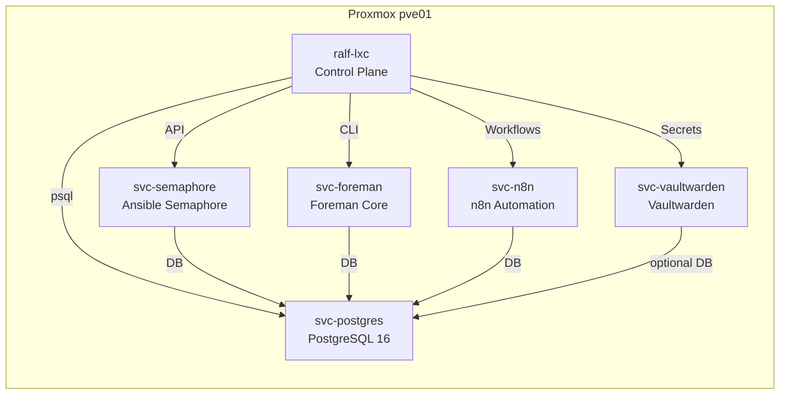

# Architekturüberblick

Ralf fokussiert auf eine klare Trennung von Control-Plane, Datenhaltung und Anwendungsdiensten. Jede Komponente läuft in einem dedizierten Ubuntu-24.04-LXC auf Proxmox und lässt sich über Variablen parametrisieren.

## Container-Landschaft

## Steuerungsebene

- **Ansible** verwaltet Basiskonfigurationen, Dienste und Backups. Inventare werden in `ansible/inventories/home/` gepflegt.
- **OpenTofu** (CLI) steht für zukünftige Infrastruktur-Automatisierung bereit.
- **Ralf-CLI** kapselt Standard-Workflows (Preflight, Build, Apply, Smoke, Backup) und nutzt das lokale `Makefile`.
- **SOPS/age** sichern Secrets; die Rolle `common` stellt Logrotate, Timesync und SSH-Hardening sicher.

## Datenhaltung

`svc-postgres` betreibt PostgreSQL 16. Die Rolle `postgresql` erstellt dedizierte DBs und Benutzer:

- `semaphore` für Semaphore UI
- `n8n` für Workflow-Automation
- `foreman` für Foreman Core
- `vaultwarden` (optional) für Vaultwarden, standardmäßig aktiviert gemäß Repositorystand

Die `pg_hba.conf` bleibt restriktiv und nutzt Variablen für erlaubte Netze.

## Anwendungen

- **Semaphore:** Web-GUI für Ansible-Jobs. Konfiguration über SOPS-Variablen, Healthcheck via `/api/info`.
- **Foreman:** Installiert über den offiziellen Foreman-Installer mit Parametern für eine externe Datenbank.
- **n8n:** Läuft als systemd-Service mit `.env` Datei (SOPS). Healthcheck per `GET /healthz`.
- **Vaultwarden:** Standardmäßig an PostgreSQL angebunden; wahlweise SQLite per Variable. Healthcheck auf `/admin` (401/200 erwartet).

## Backups & Monitoring

- **Borgmatic:** Konfiguration per Rolle `borgmatic`. Jeder stateful Dienst hat eine eigene Konfigurationsdatei unter `/etc/borgmatic.d/`.
- **Smoke-Checks:** `scripts/smoke.sh` ruft HTTP-Endpoints und `psql`-Checks auf. Jeder Dienst liefert eine `command`-Definition, die im Makefile aggregiert wird.
- **Logging:** `/var/log/ralf/` enthält zusammengeführte Logs der Rollen. Ein Logrotate-Job sorgt für Retention.

## Erweiterbarkeit

- Zusätzliche LXC-Container lassen sich durch Kopieren eines `pct-create`-Skripts und Anpassen der Variablen hinzufügen.
- Weitere Rollen folgen der Struktur `ansible/roles/<dienst>/` mit `tasks/`, `defaults/`, `templates/` und `handlers/`.
- OpenTofu-Module können unter `infra/` ergänzt werden. `make plan` erkennt automatisch `.tf`-Dateien.

